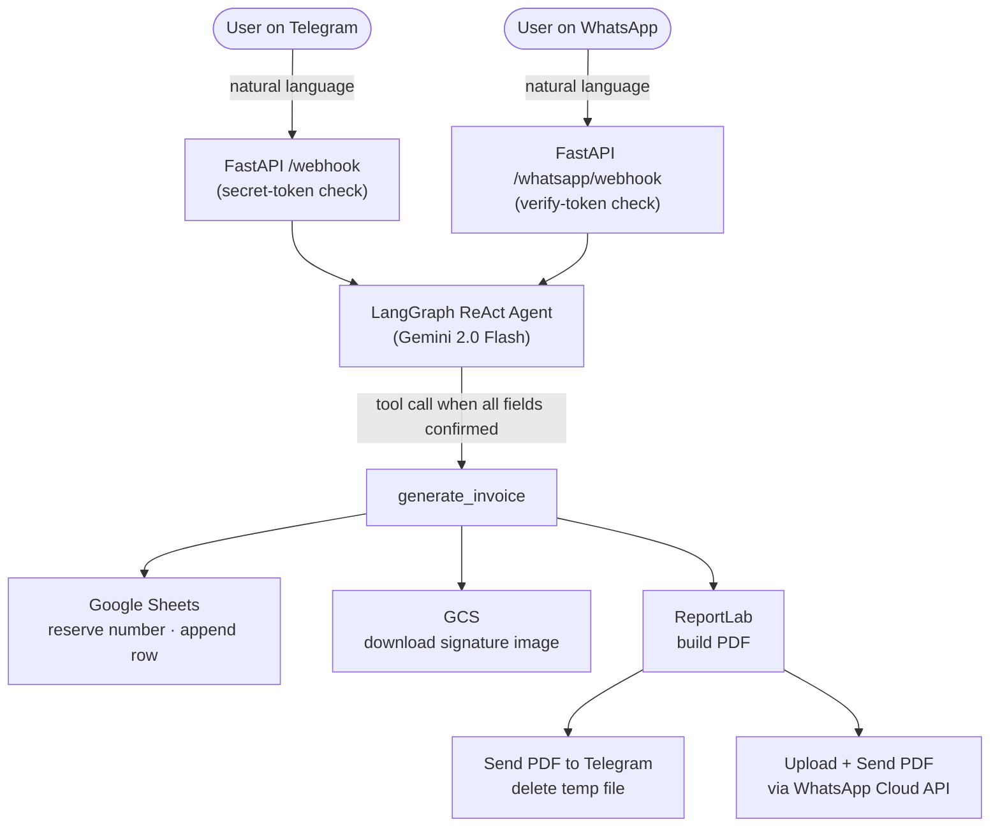

# invoice-agent

**A Telegram + WhatsApp bot that generates PDF invoices from plain-language messages.** Describe an invoice in a chat; the bot extracts the data, reserves an invoice number in Google Sheets, generates a PDF, and sends it back — all in one conversation.

[](LICENSE)
[](https://www.python.org)
[](https://fastapi.tiangolo.com)
[](https://ai.google.dev)
[](https://cloud.google.com/run)

---

## What it looks like

```
You:  New invoice for Acme Corp, 123 Business Park, Mumbai.
      Fees: Legal consultation 15000, Contract drafting 10000.
      Disbursements: Filing fee 500, Stamp duty 200.
      Date: today.

Bot:  Invoice 2026-27/1 for ₹25,700 is ready.
      [sends PDF]
```

Works identically on **Telegram** and **WhatsApp** — no forms, no spreadsheet fiddling, just describe the invoice the way you'd say it out loud.

---

## Architecture



**Stack:** FastAPI · python-telegram-bot · WhatsApp Cloud API · LangGraph · Gemini · ReportLab · Google Sheets (ADC) · GCS · Cloud Run

**Optional:** MongoDB — persists conversation state across restarts. Without it, state is in-memory and lost on restart.

---

## Project structure

```
invoice-agent/
├── app/
│   ├── main.py              # FastAPI app + Telegram & WhatsApp webhooks
│   ├── agent.py             # LangGraph graph + system prompt
│   ├── sessions.py          # Checkpointer + session/thread-ID management
│   ├── config.py            # Settings (pydantic-settings + .env)
│   ├── whatsapp.py          # WhatsApp Cloud API channel
│   └── tools/
│       ├── invoice_tool.py  # @tool generate_invoice
│       ├── pdf_generator.py # ReportLab PDF generator
│       └── sheets_ledger.py # gspread read/append via ADC
├── Dockerfile
├── .env.example
├── env.yaml.example
└── requirements.txt
```

---

## Quick start (local)

Useful for verifying PDF output and Sheet writes before deploying. Telegram webhooks require a public HTTPS URL, so bot messaging only works once deployed to Cloud Run.

**Prerequisites:** Python 3.12+, a GCP project with a service account, a Telegram bot token.

### 1. Install

```bash
git clone https://github.com/taha2009/invoice-agent.git
cd invoice-agent
pip install -r requirements.txt
```

### 2. Google Sheets auth (ADC)

```bash
export GOOGLE_APPLICATION_CREDENTIALS=/path/to/service_account.json
```

The service account only needs to be shared on the Google Sheet as **Editor** — no project-level IAM roles required.

### 3. Google Sheet

Create a new Google Sheet and copy the Sheet ID from the URL:
`https://docs.google.com/spreadsheets/d/<SHEET_ID>/edit`

Leave it blank — the app creates a tab named after `INVOICE_PREFIX` and writes headers on first run.

### 4. Configure

```bash
cp .env.example .env
# fill in all values
```

### 5. Run

```bash
uvicorn app.main:app --reload --port 8000
```

### 6. Signature image (optional)

Upload a PNG or JPG to a GCS bucket and set:

```env
GCS_BUCKET=your-gcs-bucket
GCS_SIGNATURE_OBJECT=signatures/signature.png
```

The PDF falls back to the typed issuer name if either variable is unset or the download fails. For local development, authenticate with:

```bash
gcloud auth application-default login
```

### 7. WhatsApp (optional)

The WhatsApp channel is disabled when `WHATSAPP_ACCESS_TOKEN` is empty. To enable it:

1. Create a **Meta App** with the WhatsApp product and obtain a **permanent system user token** and your **Phone Number ID**.
2. Set the four `WHATSAPP_*` env vars in `.env`:

```env
WHATSAPP_ACCESS_TOKEN=your-system-user-token
WHATSAPP_PHONE_NUMBER_ID=1234567890
WHATSAPP_APP_SECRET=your-meta-app-secret   # from Meta app dashboard → Settings → Basic
WHATSAPP_VERIFY_TOKEN=any-secret-you-choose
ALLOWED_WHATSAPP_NUMBERS=919876543210      # leave blank to allow all
```

3. Deploy the service (or expose it via ngrok for local testing), then in the Meta app dashboard set the webhook URL to `https://<your-service>/whatsapp/webhook` and subscribe to the **messages** field using the same `WHATSAPP_VERIFY_TOKEN`.

Send **"reset"** or **"/reset"** in WhatsApp to start a fresh conversation, just like `/reset` on Telegram.

---

## Cloud Run deployment

On Cloud Run, Google Sheets auth uses ADC from the attached service identity — no credentials file or env var needed.

### 1. Enable APIs

```bash
gcloud services enable \
  run.googleapis.com \
  sheets.googleapis.com \
  storage.googleapis.com \
  cloudbuild.googleapis.com \
  artifactregistry.googleapis.com
```

### 2. Create Artifact Registry repository

```bash
gcloud artifacts repositories create cloud-run-source-deploy \
  --repository-format=docker \
  --location=asia-south1 \
  --description="Docker images for Cloud Run"
```

### 3. Create the service account

```bash
gcloud iam service-accounts create invoice-agent-sa \
  --display-name="Invoice Bot"
```

Share your Google Sheet with the service account email as **Editor**:
`invoice-agent-sa@<PROJECT_ID>.iam.gserviceaccount.com`

Create the shared GCS bucket (if it doesn't exist yet):

```bash
gcloud storage buckets create gs://<GCS_BUCKET> \
  --location=asia-south1 \
  --uniform-bucket-level-access
```

Grant the service account read access to it:

```bash
gcloud storage buckets add-iam-policy-binding gs://<GCS_BUCKET> \
  --member="serviceAccount:invoice-agent-sa@<PROJECT_ID>.iam.gserviceaccount.com" \
  --role="roles/storage.objectViewer"
```

### 4. First deploy

```bash
cp env.yaml.example env.yaml
# fill in all values — leave WEBHOOK_BASE_URL blank for now
```

```bash
PROJECT_ID=your-gcp-project-id
REGION=asia-south1
SERVICE=invoice-agent
SA=invoice-agent-sa@${PROJECT_ID}.iam.gserviceaccount.com

gcloud run deploy $SERVICE \
  --source . \
  --platform managed \
  --region $REGION \
  --service-account $SA \
  --allow-unauthenticated \
  --env-vars-file=env.yaml \
  --min-instances=0 \
  --max-instances=2 \
  --memory=512Mi \
  --timeout=120

SERVICE_URL=$(gcloud run services describe $SERVICE \
  --region $REGION --format "value(status.url)")
echo "Service URL: $SERVICE_URL"
```

### 5. Set WEBHOOK_BASE_URL and redeploy

Update `WEBHOOK_BASE_URL` in `env.yaml` with the service URL, then redeploy:

```bash
gcloud run deploy $SERVICE \
  --source . \
  --platform managed \
  --region $REGION \
  --service-account $SA \
  --allow-unauthenticated \
  --env-vars-file=env.yaml \
  --min-instances=0 \
  --max-instances=2 \
  --memory=512Mi \
  --timeout=120
```

The startup handler registers the Telegram webhook automatically.

If WhatsApp is enabled, update the webhook URL in the Meta app dashboard to `<SERVICE_URL>/whatsapp/webhook`.

### 6. Verify

```bash
# Telegram
curl "https://api.telegram.org/bot${TELEGRAM_BOT_TOKEN}/getWebhookInfo"
```

Look for `"url": "<SERVICE_URL>/webhook"` and `"pending_update_count": 0`.

---

## Updating

```bash
gcloud run deploy $SERVICE \
  --source . \
  --region $REGION \
  --env-vars-file=env.yaml
```

---

## License

[MIT](LICENSE)
